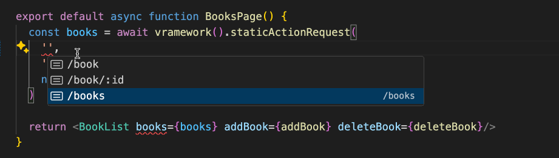

# Using Vramework with NextJS

Deploying Vramework with NextJS allows for code separation benefits without running a separate server, while also leveraging NextJS Server-Side Rendering (SSR) capabilities.



### Setting up Vramework

The vramework CLI can generate a `vramework-next.ts` file which would allow you to directly interact with your functions.

In order to do so you can run `npx @vramework/cli nextjs` and will need to have a `vramework.config.json` file within the nextJS directory.

For example:

```json reference title="vramework.config.json"
https://raw.githubusercontent.com/vramework/workspace-starter/blob/master/apps/next-pages/vramework.config.json
```

For additional functionality or feature requests, please submit an issue on the [Vramework repository](https://github.com/vramework/vramework).